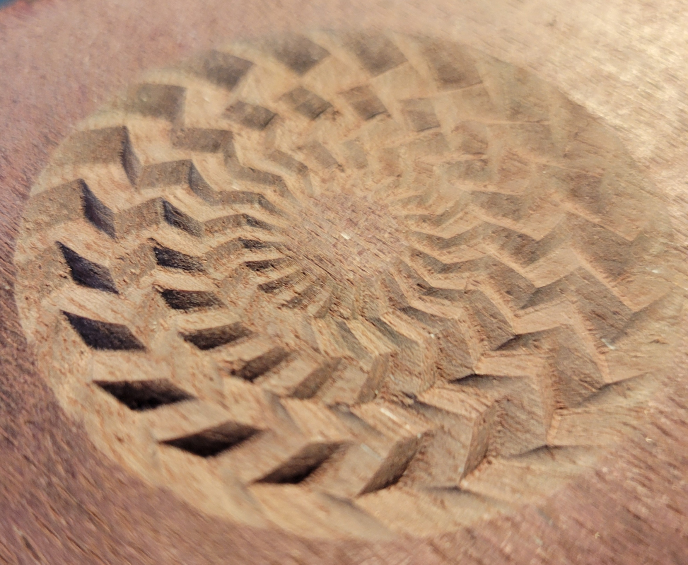

# CNC Rose Engine in React

I initially tried using CSG geometry in ThreeJS to make a preview of what the raw stock would look like after CNC ops, but that didn't work, so I am just rendering paths much like CNCJs does.

Hello visitor and fellow coders,

This program is a rose engine. It is designed to help you generate traced paths, and then turn that into machine code to engrave ornate patterns into the surface of #**-=%$.

You may of heard of the artwork from names like ClickSpring (my inspiration from Youtube, how he used a Rose Engine to engrace on silver for his wife for their anniversary)

Built with `node v14` and `npm v6`

The script is basic:
* Run `npm install` and then `npm start`
* Use the pattern editing on the right to add more patterns or edit patterns
* Click in the lower left, the "orbit control" camera is extremely zoomed in. Zoom it out with scroll wheel, left click to orbit, right click to pan.
* View preview - red is a jog move, green is a cut
* Name the pattern on the upper left text field
* Save as JSON to back up your work
* You can edit the saved patterns as raw json
* Load pattern to restore work
* Save as GCode when you want to engrave (Only GRBL flavor)

The center and top of the workpiece is 0,0,0. The pattern is to be inscribed around the center 0,0 point.
I make no promises - check your gcode and paths before you start cutting.

Uses G0 for jogging, G1 for cutting. Fixed plunge rate of 100mm/s, you can set whatever feedrate you want per-pattern.
I don't think I have any programming regarding rpm except that it's probably hardcoded to like 10000 ot 11000 rpm

[(link)](saved-First%20Trial.json) JSON file that made this picture

## Contributing
Yes please,
This has so much more it could be improved, customized, ETC. Please do make pull requests. This is in TypeScript, please make your contributions in TS too.
Don't insult the coding. This is a side project.

I'm messing with 3d vectors and feel like I'm in the Matrix flying the Nebuchadnezzar around, wires hanging down everywhere.

I rather like the AirBnB Style guide.

You can contact me (BirdTho) via my email loveslaveofjesus@gmail.com or christopher.bird.thomas@gmail.com

### Ideas
* Project-wide plunge rate, feed rate
* Bulk edit rose patterns
* start/end phase could be an equation or use an easing function
* All things could use easing functions (default is lerp presently)
* Get better camera controls
* Color the paths based on Z depth, so that they don't all look one color
* Make 3d representation of cute surface (not whole surface) and (without the tool edge)
* Support other flavors of GCode

### For you to explore:
Look at ThreeJSViewLathed.tsx if you want to see the 3d mesh generation code I was messing with.
It uses moddedComputeFrenetFrames and ModdedParametricGeometry stuff. 
(Parametric welding in the U and V directions as the toolpath is a torus, and Frenet frames which have their normal as always Z-up for vertical CNCing)

**WARNING** **WARNING**
CSG operations are very slow and buggy. App will lag or freeze browser tab.
If you wanna contribute, get that feature its own Worker() instance.

## Available Scripts

In the project directory, you can run:

### `npm start`

Runs the app in the development mode.\
Open [http://localhost:3000](http://localhost:3000) to view it in the browser.

The page will reload if you make edits.\
You will also see any lint errors in the console.

### `npm run build`

Builds the app for production to the `build` folder.\
It correctly bundles React in production mode and optimizes the build for the best performance.

The build is minified and the filenames include the hashes.\
Your app is ready to be deployed!

See the section about [deployment](https://facebook.github.io/create-react-app/docs/deployment) for more information.